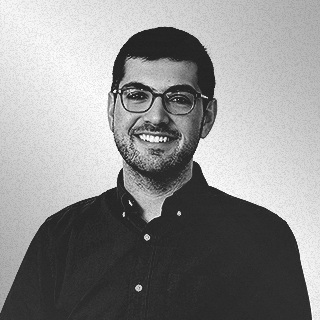
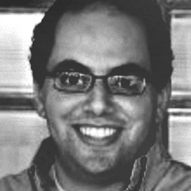
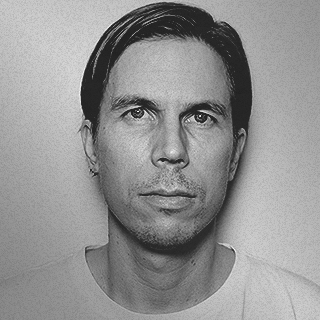
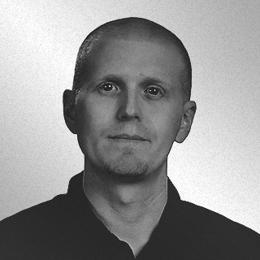
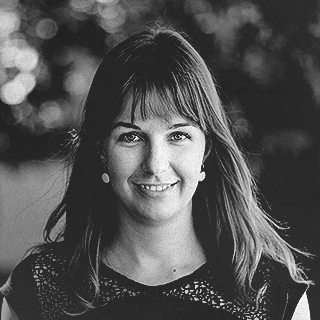
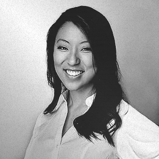

# AI for Healthcare Nanodegree Instructor Biographies

#### Amanda Moran - Developer Advocate, Datastax
Amanda is a developer Advocate for DataStax after spending the last 6 years as a Software Engineer on 4 different distributed databases. Her passion is bridging the gap between customers and engineering. She has degrees from University of Washington and Santa Clara University. 
     

#### Ben Goldberg - Staff Engineer, Spothero
In his career as an engineer, Ben Goldberg has worked in fields ranging from Computer Vision to Natural Language Processing. At SpotHero, he founded and built out their Data Engineering team, using Airflow as one of the key technologies. 
   

#### Sameh El-Ansary - CEO, Novelari and Lecturer, Nile University and American University in Cairo
Sameh is the CEO of Novelari, lecturer at Nile University, and the American University in Cairo (AUC) where he lectured on security, distributed systems, software engineering, blockchain and BigData Engineering.
    

#### Olli Iivonen - Data Engineer, Wolt
Olli works as a Data Engineer at Wolt. He has several years of experience on building and managing data pipelines on various data warehousing environments and has been a fan and active user of Apache Airflow since its first incarnations.
    

#### David Drummond - VP of Engineering, Insight
David is VP of Engineering at Insight where he enjoys breaking down difficult concepts and helping others learn data engineering. David has a PhD in Physics from UC Riverside.
     

#### Judit Lantos - Data Engineer, Split
Judit was formerly an instructor at Insight Data Science helping software engineers and academic coders transition to DE roles. Currently, she is a Data Engineer at Split where she works on the statistical engine of their full-stack experimentation platform.
    

#### Juno Lee - Curriculum Lead, Udacity
Juno is the curriculum lead for the School of Data Science. She has been sharing her passion for data and teaching, building several courses at Udacity. As a data scientist, she built recommendation engines, computer vision and NLP models, and tools to analyze user behavior.
 